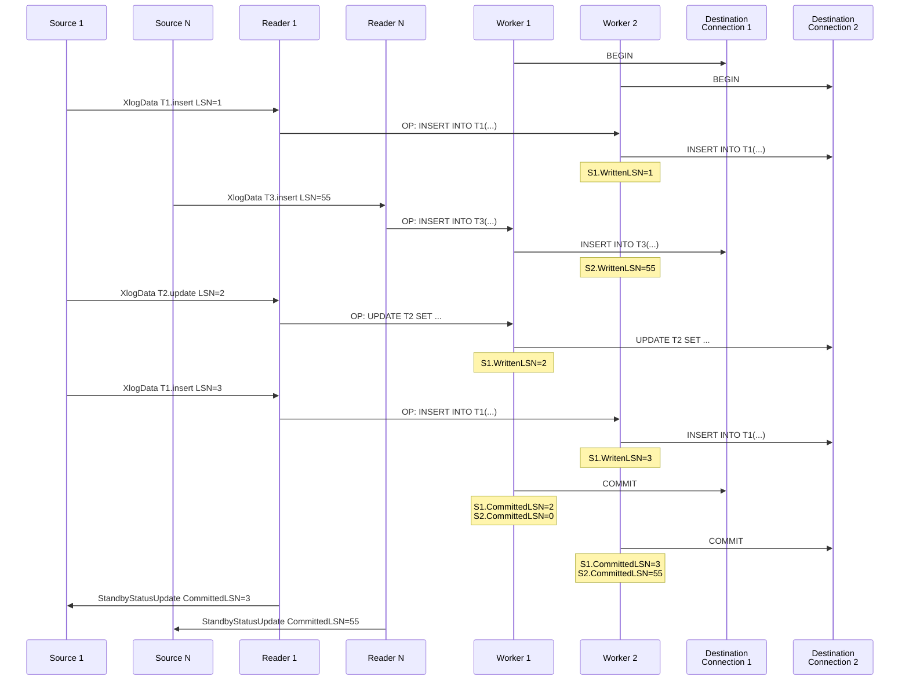

# Architecture

`kuvasz-streamer` opens a logical replication connection to each of the source databases and a number of connections to the destination database corresponding to the number of workers.

Depending on the running mode, it also reads its mapping configuration either from a static YAML file or from an SQLite database.

{: width="50%"}

## Initial synchronization

On startup `kuvasz-streamer` will check the state of the publications and replication slots. If they don't exist, it will create them and initiate a full sync. If the slot exists but some tables have been added, a full sync for these tables only is performed.

A separate goroutine is created for each source to handle the initial sync process. Source tables are synchronized sequentially within that source. Parallelizing this would increase the load substantially on the source server but may be something to look at in the future.

## Streaming mode

After it has finished initial synchronization, Kuvasz-streamer enters streaming mode. In this mode, Kuvasz-streamer listens to the Postgres logical replication slot and processes the logical replication records as they arrive.

For each source database, `kuvasz-streamer` creates a single dedicated Reader goroutine. This goroutine open a Postgres replication connection. It reads replication messages and send updates to the source.

For each worker, `kuvasz-streamer` creates a dedicated worker goroutine that opens a regular connection to the destination. This worker applies changes on the destination database. Having multiple workers allows parallelizing write queries and enhancing performance.

When a replication message (XlogData) is received, `kuvasz-streamer` computes the SQL statement to apply on the destination. Then it selects the worker based on a hash of the source table. It then creates an operation (OP) and sends it to that worker. This mechanism ensures that all changes to a given table are processed in the order they were received.

A worker creates a transaction and uses it as a container for all received messages. After a configurable timeout, usually, 1 second, the transaction is committed and the committed LSN is recorded in a shared map for use by the Reader goroutines.

The Reader goroutines periodically calculate the committed LSN and send a Standby Status Update message to the source. This ensures that these messages are deleted from the replication slot. The Committed LSN is computed to guarantee that all operations from a particular source have been applied on all worker connections.

A simple example:

